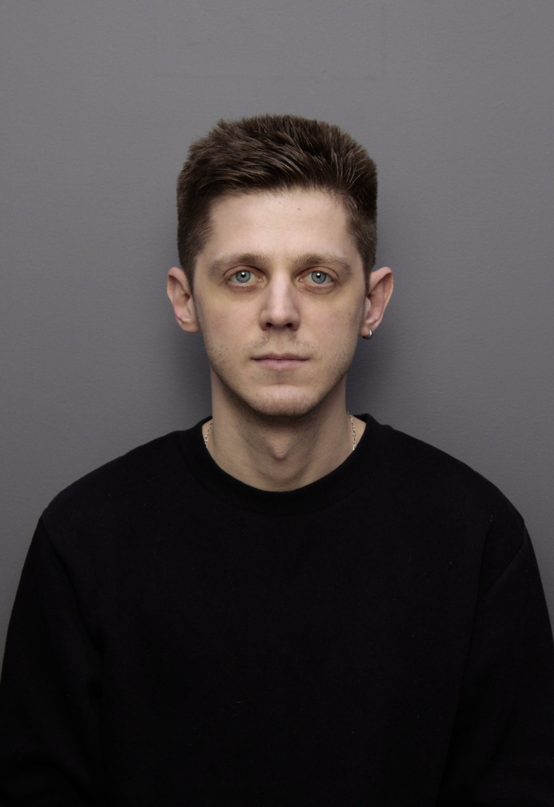

# Илья — Product Director

  

## О себе
Я — продакт‑директор, сфокусирован на результатах и понятной метрике ценности. Работаю на стыке продукта, аналитики и автоматизации. Люблю структурировать хаос, запускать инициативы короткими циклами и проверять гипотезы данными, а не верой.

**Фокусы:**
- JTBD/продуктовые интервью, формулирование проблем и outcome‑метрик
- Циклы discovery → delivery, приоритизация (RICE/ICE), Roadmap как система договорённостей
- Системы метрик: North Star, unit‑экономика, когортный анализ, ARPU/Retention/Conversion
- Эксперименты: A/B‑тесты, feature flags, rollouts
- Кросс‑функциональная работа с разработкой/дизайном/маркетингом/операциями

## Технологии и инструменты
- **Data/Automation:** Python (скрейпинг/selenium, обработка данных), SQL (базовый), Git
- **CRM/Продажи:** Bitrix24 (виджеты, вебхуки, отчёты «время в стадии»)
- **BI/Аналитика:** отчетность, сегментации, воронки, настройка событий
- **Продакшн‑инструменты:** Markdown, GitHub/GitHub Pages, Jira/YouTrack, Confluence/Notion

## Сide‑проекты
- Отчёт «время в стадии» для Bitrix24 (узкие места процесса продаж)
- Скрейпер для каталога напольных покрытий (selenium + устойчивые ожидания)
- Творческое: гитара/музыка, микро‑видео и эксперименты с нейросетями

## Как работать со мной
- Чёткая постановка целей (в терминах результата для пользователя/бизнеса)
- Короткие гипотезы, быстрые итерации, одно «источник правды» по метрикам
- Прозрачные статусы (roadmap + чек‑ин каждую неделю)

---
